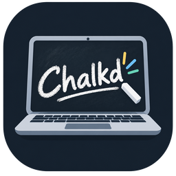

# Chalkd



A touch-first infinite whiteboard for teachers, for Linux. Free and open source (GPL-3.0-or-later).

See [PLAN.md](PLAN.md) for the design and build phases.

## Install

On Arch Linux or Omarchy, download `chalkd-1.0.0-1-x86_64.pkg.tar.zst` from the [latest release](https://github.com/DibsCodes/chalkd/releases/latest) and install it:

```sh
sudo pacman -U chalkd-1.0.0-1-x86_64.pkg.tar.zst
```

Chalkd then shows up in the app launcher. If CUPS is running, the install also adds the **Chalkd** printer. If you added the printer from a source checkout before, run `npm run printer:uninstall` first, or pacman will refuse to overwrite its files.

To build the package yourself, use the [PKGBUILD](packaging/arch/PKGBUILD): copy `PKGBUILD` and `chalkd.install` into an empty folder and run `makepkg -si`.

## Features

- **Touch:** one finger uses the current tool. Two or three fingers move the board; swipe and let go and it keeps gliding to a stop. Four fingers (two on each hand) also zoom: move your hands apart to zoom in, together to zoom out.
- **Pens and highlighters:** as many as you like. Tap one to use it. Tap it again (or long-press) to change its color or thickness, or to delete it. Hold one a little longer, until it's outlined, and slide it to move it along its row. **+** adds a copy.
- **Highlighter:** sits underneath pen ink, so it never dulls your writing.
- **Eraser:** rubs out just what you touch, or whole strokes. Circle some ink and tap inside the circle to erase everything in it. Long-press it for size and Clear Board, which can be undone.
- **Undo/redo:** toolbar buttons, or Ctrl+Z / Ctrl+Shift+Z.
- **Settings (⚙):**
  - board background color and pattern, and making that the default for new boards
  - ink smoothing
  - palm rejection
  - light/dark theme and toolbar size
  - the Chalkd folder location
- **Saving:** boards autosave to `~/Documents/Chalkd` and the last board reopens on launch.
- **Select (lasso icon):**
  - Draw a loop around things, or tap one, to select.
  - Drag the selection to move it; drag a corner to resize it.
  - **Delete** sits above the selection (or press Delete).
- **Import (picture icon):** pictures (PNG, JPEG, WebP, GIF, SVG) and PDFs from a file. PDF pages are placed top to bottom, ready to write on. You can also paste a picture (Ctrl+V) or drag files onto the board. Pictures sit underneath ink and highlighter.
- **Print to Chalkd:** once the printer is added (the package does it; from source, run `npm run printer:install`, which asks for your password), every app's print dialog has a **Chalkd** printer. Printing to it opens the document as a new board, named after it, in the notebook you're working in. If Chalkd is closed, printing opens it (with the installed package; from source, a printout waits until you next start Chalkd). From source, `npm run printer:uninstall` removes the printer; uninstalling the package does it for you.
- **Export (share icon, or Export… on a board in the drawer):**
  - PDF as one page sized to fit everything, or as printable Letter/A4 pages at real size. The orientation is chosen to use fewer pages.
  - PNG of the whole board or of what's on screen, at 2×.
  - Optionally leave out the board's color and pattern (handy for dark boards). PDF ink is vector, so it stays sharp at any size.
- **Drawer (☰):** your notebooks and boards as a tree.
  - Tap a board to open it; the drawer stays open until you tap the board. Tap a notebook to expand it.
  - **+ Board** and **+ Notebook** create new ones next to the board you're on.
  - Long-press an item for Rename, Move to…, New board here (notebooks), Duplicate (boards), and Delete. Duplicate puts a copy just below the board and opens it, ready to rename. Deleting moves it to the system trash.
  - Long-press and drag to reorder, or drop onto a notebook to move something into it.

## Running from source

```sh
npm install
npm start          # the app (native Wayland)
npm run start:x11  # fallback through XWayland
npm run spike      # Phase 0 input spike: logs every touch to the terminal
npm test           # unit tests
npm run check      # type-check TypeScript and Svelte
npm run bench      # rendering benchmark, prints timings and quits
npm run printer:install    # add the Chalkd printer (needs sudo)
npm run printer:uninstall  # remove it
```

At a desk: the mouse draws, the middle button or scroll wheel pans, and Ctrl+scroll or a touchpad pinch zooms.

| Shortcut | Action |
|---|---|
| Ctrl+Z | Undo |
| Ctrl+Shift+Z or Ctrl+Y | Redo |
| Ctrl+0 | Zoom to 100% |
| Ctrl+1 | Fit content |
| Ctrl+V | Paste a picture |
| Ctrl+A | Select everything (Select tool) |
| Delete | Delete the selection |
| Ctrl+Shift+D | Show render stats |

`CHALKD_SELFTEST=<dir> npm start` draws with a simulated mouse, saves screenshots to `<dir>`, and quits. Self-tests and benchmarks run in a throwaway library and never touch `~/Documents/Chalkd`. Set `CHALKD_SANDBOX=<dir>` to point any run at a scratch library and settings folder.
